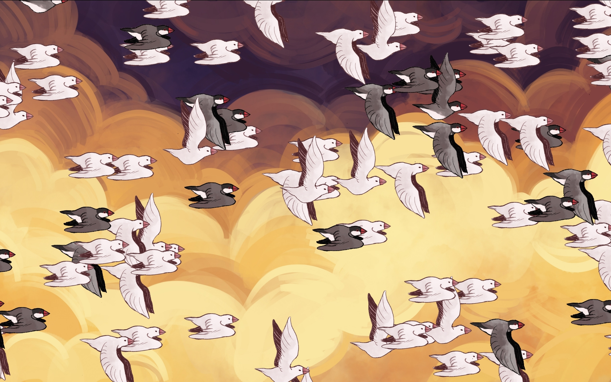

# flock

A weekend project providing infinite bunchos.

Illustration by [Jean](https://www.jeanyoung.me/).

Rest by me.

This started as two simple concepts combined into one: **scrolling** and **bunchos**.

I decided immediately that each scroll would create a buncho that would fly across the screen. The first thing I implemented was the spawning on each scroll, and the despawning shortly after. I got a chunky placeholder buncho from Jean to work out the flapping. At first this was in Javascript, swapping out the img src each time, but I eventually moved that to a CSS animation.

Next was getting the birds to cross the screen. I knew this would happen in CSS, but I wanted some randomization, which CSS just doesn't (and shouldn't) do. In comes CSS custom properties (variables)! I specified the animation in terms of some custom properties that I would set on each buncho when it gets generated in Javascript. Once that was done, Jean got me some finalized bunchos as well as a background and the site was functional. I added the three initial bunchos to give a preview.

Now it was time for polish. I added a media query that swaps in a tall background on vertical viewports. I added the "Scroll" in the middle so people would know what to do. I added the info box to link it to the rest of the internet. I really wanted the screen to be completely empty except for the bunchos and background, so I decided the info box needed to have the largest possible input space: a click anywhere on the screen. This is meant to be accidentally triggered.

After showing it around, I found myself wondering exactly how many bunchos flew by. The counter was added, which has to be the best possible secondary feature on the site. With that came the next few changes: a pinned counter box, a cookie to save the count, custom checkboxes, a cookie to save whether the input box is pinned, scrolling in the info box. On mobile the info box takes up almost the whole screen, so I added the close button for easier closing as opposed to clicking outside it.

Alongside that, I changed the Javascript timers to event handlers: instead of waiting a few seconds for the buncho to leave the screen, it gets an event handler attached to its "animationend" event that deletes it. And I also got a dark buncho from Jean so there would be two kinds.

There's a lot of game design that arises from Flock. Scrolling was the perfect choice for input since it is easy to do on any device (on a touchscreen it's even easier than clicking) and can be done more rapidly than anything except mouse movement. Mouse movement would not be a good input because it happens too easily and is needed for other things outside the site. It's too sacred of an input to hijack for creating birds. My mouse is a Logitech G502, which has a scroll wheel with a "clicky" mode and a frictionless mode. The frictionless mode makes the wheel surprisingly fun to use on its own without even being attached to a computer, so using it on the site is fantastic.

The counter adds a whole new level to the experience. It adds subtle replayability: you can come back at any time to collect even more bunchos, and it won't be for nothing. The number increases more than I thought from just watching, but I assure it is accurate, although a low amount of bunchos may fly under or over the viewport. Hitting recognizable numbers, like the current year and powers of 10, invokes the brain's pattern recognition. They're good places to stop and close the site, but when you come back, three bunchos fly across the screen to push you past that milestone and encourage more scrolling. While bunchos take a moment to fly onscreen, the counter updates immediately, giving instant feedback with eye-catching movement every time you move your finger. The feedback gives you a sense of control: you know exactly how many bunchos are being created from each movement. You can practice sending them one-by-one or go all out and send as many as possible.
